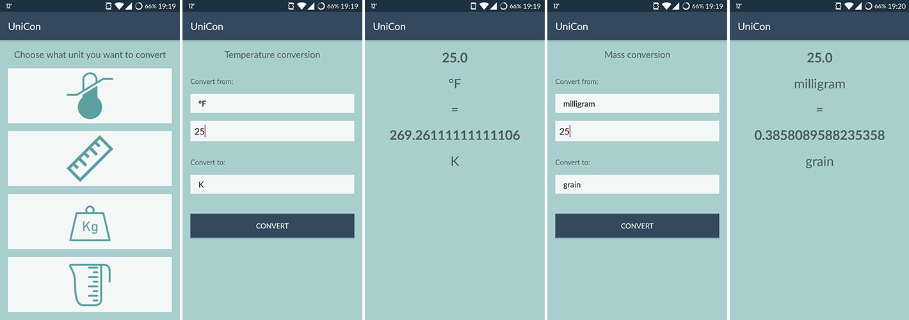

UniCon - Unit converter
=========================

Faculty of Electrical Engineering, Computer Science and Information Technology Osijek  
Mobile platform application development  
Second Homework  

## Requirements

* main screen with buttons
* implement four conversions
* create Activity which shows results
* connect Activities using Intent
* style results

## Description

There are 3 activities in this android project. MainActivity which has four ImageViews used as buttons, ConvertActivity which is used to get input from the user and ResultActivity which shows the result of conversion. Activities are connected using explicit intents. Clicking on one of the four images on MainActivity will take user to ConvertActivity. By typing in value, selecting input and output unit and finnaly clicking on *convert* button ResultActivity will be launched. ResultActivity shows both input and output values and units.

## Screenshots

## Resources

* [Spinner documentation](https://developer.android.com/reference/android/widget/Spinner.html#attr_android:spinnerMode)
* [Imperial units](https://en.wikipedia.org/wiki/Imperial_units)
* [Metric Conversions](http://www.metric-conversions.org/)
* [README editing](https://github.com/adam-p/markdown-here/wiki/Markdown-Cheatsheet)
* [Icons](https://icons8.com/)
